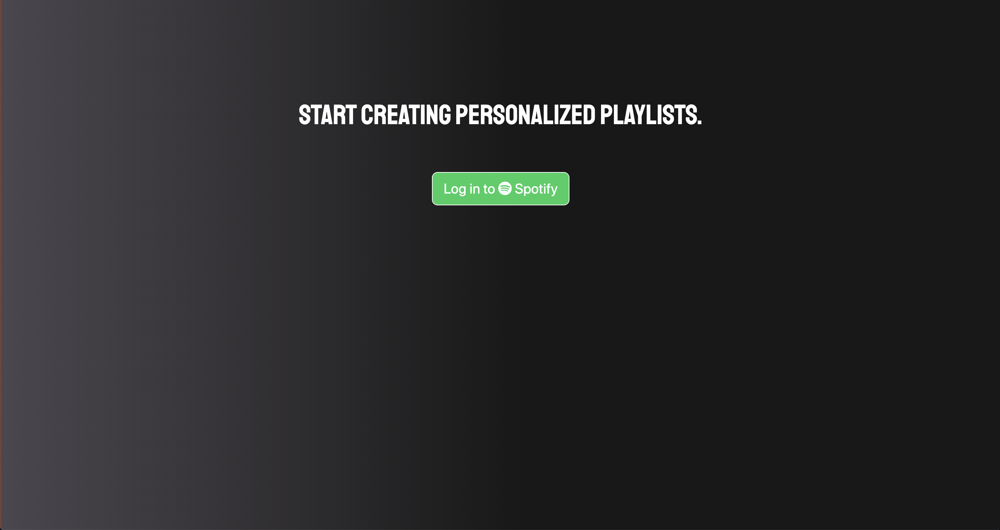
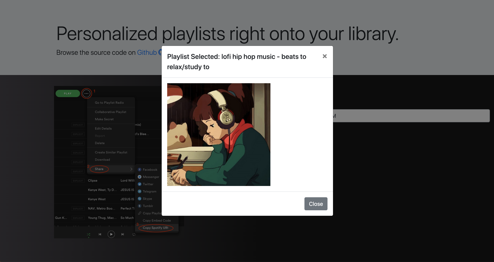

# Spotify Personalizer

## Description
A web service allowing you to filter input playlists, providing you with only songs by artists that you listen to through a playlist instantly generated onto your Spotify library.

## Stack
```
HTML/CSS
BootStrap 
NodeJS
Express.js
OAuth 2.0
```

## Screenshots
#### 1. Login Screen

#### 2. Playlist Selection Screen

#### 3. After Selection Screen

#### 4. New playlist instantly appears in your Spotify!

